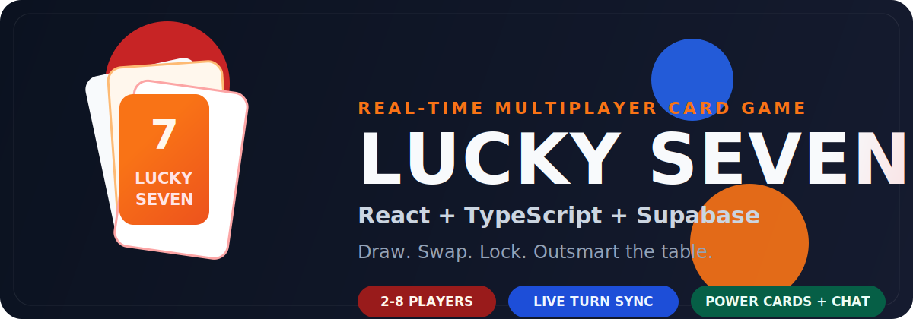

# Lucky Seven<sup>TM</sup>

<div align="center">
  <h3>Real-time multiplayer card game built with React, TypeScript, and Supabase</h3>
  <p>
    Draw from the pile, manage hidden cards, use power effects, and finish with the lowest score.
  </p>
  <p>
    
  </p>
  <p>
    <a href="https://luckyseven.site">
      
    </a>
    <a href="https://github.com/KamalHazriq/lucky-seven-supabase/actions/workflows/deploy.yml">
      
    </a>
    
    
    
    
  </p>
  <p>
    <a href="https://luckyseven.site">Live App</a> |
    <a href="https://kamalhazriq.github.io/lucky-seven-supabase/">GitHub Pages</a> |
    <a href="#highlights">Highlights</a> |
    <a href="#getting-started">Getting Started</a> |
    <a href="#architecture">Architecture</a>
  </p>
</div>

---

## Overview

Lucky Seven is a real-time online card game for 2 to 8 players. Every player manages a hidden hand, reacts to live turn updates, and tries to finish with the lowest total score. Sevens are worth zero, power cards can swing the board, and Supabase keeps public and private game state synchronized across all players.

Built by Kamal Hazriq and Imaduddin. Hosted at [luckyseven.site](https://luckyseven.site).

## Latest Patch

### v1.0.2 · Reliability & Recovery Pass · 21 March 2026

- Added backend integration coverage for critical SQL gameplay flows including draw, discard, swap, powers, AFK skip, vote-kick, rematch, and reveal scoring
- Replaced more brittle client-side log parsing with structured action events carried through game history
- Hardened reconnect and recovery UX in the lobby, history views, and error boundaries
- Split oversized Supabase/gameplay modules, strengthened generated database typing, and added CI checks for migrations, backend tests, frontend tests, and build safety
- No gameplay rules, scoring balance, card mechanics, or intended flow changes in this patch

## Highlights

| Area | What it includes |
| --- | --- |
| Multiplayer | Real-time lobbies and gameplay for 2 to 8 players, anonymous auth, shareable join codes |
| Game customization | Configurable power assignments, deck size, joker count, turn timer, 3-card or 4-card hands, no-memory mode |
| Competitive tools | AFK protection, vote-kick flow, rematch support, action versioning, race-safe RPCs |
| Social features | In-game chat, live lobby updates, patch notes modal, share links |
| Reliability | Supabase Realtime, RLS-protected private state, structured action events, backend integration tests, analytics, client error logging, maintenance jobs |
| UX polish | Mobile-friendly layout, premium table themes, animations, sound effects, results celebration |

## Gameplay At A Glance

- Players: 2 to 8
- Goal: finish with the lowest hand total
- Hand size: 3 or 4 face-down cards depending on lobby settings
- Special scoring rule: 7s are worth 0
- Turn flow: draw from the draw pile or discard pile, then swap, discard, or use a power
- End condition: when the draw pile is exhausted, all hands are revealed and scored
- Tiebreaker: the player with more 7s wins if totals are tied

### Base Scoring

- Ace = 1
- 2 through 10 = face value
- 7 = 0
- J, Q, K, Joker = 10

### Default Power Cards

Power assignments are configurable per lobby. These are the default mappings:

| Card | Power | Effect |
| --- | --- | --- |
| Jack | Peek All | View all of your face-down cards |
| Queen | Swap | Swap any two unlocked cards between players |
| King | Lock | Lock one card so it cannot be swapped |
| 10 | Unlock | Remove a lock from a locked card |
| Joker | Chaos | Randomly rearrange another player's unlocked cards |

## Tech Stack

| Layer | Tools |
| --- | --- |
| Frontend | React 19, TypeScript, Vite, Tailwind CSS v4 |
| Backend | Supabase, PostgreSQL, Realtime, Row Level Security, anonymous auth |
| Motion and audio | Framer Motion / Motion, Web Audio sound effects |
| Hosting | GitHub Pages with custom domain support |
| Tooling | ESLint, TypeScript project references, Vitest |

## Getting Started

### 1. Create a Supabase project

1. Open the [Supabase Dashboard](https://supabase.com/dashboard)
2. Create a new project
3. Enable **Anonymous Sign-ins** under **Authentication > Providers**
4. Copy the project URL and anon key from **Settings > API**

### 2. Apply the database schema

Run the migrations from `supabase/migrations/`:

```bash
supabase link --project-ref your-project-ref
supabase db push
```

If you prefer the SQL editor, apply the migration files in `supabase/migrations/` in order.

### 3. Configure environment variables

```bash
cp .env.example .env
```

Then fill in:

```env
VITE_SUPABASE_URL=https://your-project-ref.supabase.co
VITE_SUPABASE_ANON_KEY=your-anon-key
```

### 4. Run locally

```bash
npm install
npm run dev
```

Open [http://localhost:5173/](http://localhost:5173/).

### 5. Build and test

```bash
npm run lint
npm test
npm run build
```

### 6. Validate backend changes

The repo now includes Docker-backed integration tests for the critical SQL RPC flows and a migration-order guard for future schema changes:

```bash
npm run verify:migrations
npm run test:backend
```

These commands require Docker locally. CI runs both checks automatically before deploys.

## Deployment

Deployment is automated through GitHub Actions. Every push to `main` builds and deploys the app.

### GitHub Pages setup

1. Open **Settings > Pages**
2. Set **Source** to **GitHub Actions**
3. Add these repository secrets under **Settings > Secrets and variables > Actions**

| Secret | Value |
| --- | --- |
| `VITE_SUPABASE_URL` | `https://your-project.supabase.co` |
| `VITE_SUPABASE_ANON_KEY` | your Supabase anon key |

The repo includes `public/CNAME`, so the custom domain remains attached across deployments:

```txt
luckyseven.site
```

The app uses `HashRouter`, so GitHub Pages routes resolve without a custom `404.html` fallback:

```txt
https://luckyseven.site/#/game/abc123
```

## Architecture

All authoritative game state lives in PostgreSQL through Supabase. Clients subscribe to game-scoped realtime updates while sensitive data stays separated in private tables guarded by RLS and server-side RPCs.

### Core data model

| Table | Purpose |
| --- | --- |
| `games` | Game metadata, turn state, settings |
| `game_players` | Seats, locks, player presence, public player state |
| `game_private_state` | Hidden hand data, known cards, drawn-card state |
| `game_internal` | Draw pile and internal-only game data |
| `game_reveals` | Safe end-game reveal records |
| `game_history` | Action log entries with human-readable messages and structured event payloads |
| `game_chat_messages` | Chat messages |
| `game_summaries` | Final scores and game stats |
| `global_stats` | Visits and aggregate counters |
| `analytics_events` | Lightweight analytics events |
| `client_error_logs` | Client-side crash and error reports |

### Security model

- Anonymous sign-in keeps onboarding friction low
- SECURITY DEFINER RPCs handle writes on the server side
- Row Level Security protects private hand data
- Action versioning helps prevent duplicate or stale actions
- Database locking is used in gameplay RPCs to reduce race conditions
- Public clients only receive state they are allowed to see

### Migration strategy

Legacy duplicate prefixes at `00018_*` and `00019_*` are intentionally preserved for compatibility with already-applied environments. New migrations are expected to stay unique from this point onward, and the baseline plan is documented in [docs/migration-baseline-strategy.md](docs/migration-baseline-strategy.md).

<details>
<summary><strong>Project structure</strong></summary>

```txt
src/
|-- components/        # Game UI, modals, panels, and shared primitives
|-- constants/         # Release data and static configuration
|-- hooks/             # Realtime, input, animation, and gameplay hooks
|-- lib/               # Core game logic, Supabase services, types, helpers
|-- pages/             # Home, Join, Lobby, Game, Results
|-- App.tsx            # Router
|-- main.tsx           # App entry point
`-- index.css          # Theme variables and global styling
public/
`-- CNAME              # Custom domain for GitHub Pages
supabase/
|-- functions/         # Edge functions for maintenance and cleanup
`-- migrations/        # Database schema and RPC migrations
.github/
`-- workflows/         # Deploy and maintenance workflows
```

</details>

## Additional Features

- Realtime lobby state and active game synchronization
- In-game chat and temporary chat bubbles
- Turn timer with AFK handling
- Vote-kick flow for active sessions
- Rematch lobby creation
- Global stats, analytics, and feedback collection
- Client-side error logging for production debugging
- Dev mode tools for monitoring and inspection
- Scheduled maintenance and cleanup support

## License

This project is licensed under the Creative Commons Attribution-NonCommercial 4.0 International License.

You may view, study, and modify the code for personal or educational use.

Commercial use, redistribution for profit, or selling derivative works based on this project is prohibited without permission from the author.
